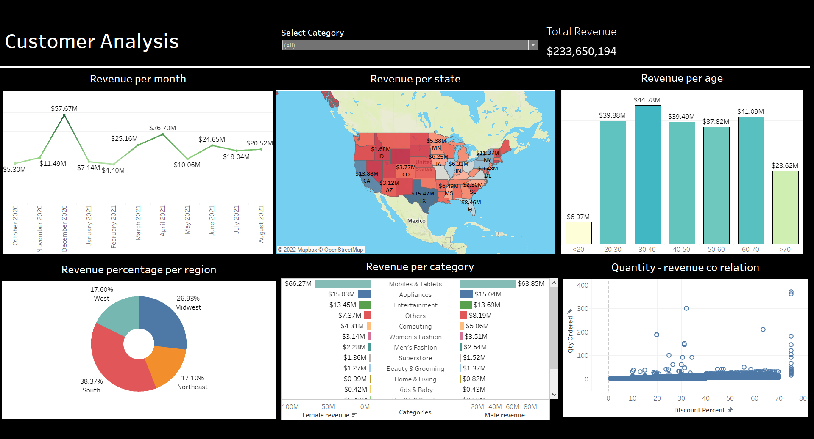

# Customer Sales Dashboard

_______________________________________________________________________________________________________________________________________________________________________

The goal of this project was to create a customer sales dashboard using Tableau to visually represent key sales metrics and trends for a company. The dashboard was designed to provide a high-level overview of the company's sales performance, as well as allow users to drill down into specific data points and explore trends in more detail.

The dashboard included a variety of charts and graphs, such as line graphs, bar charts, and pie charts, to represent data in an easy-to-understand format. It also included interactive features, such as filters and parameters, to allow users to customize the data displayed on the dashboard and focus on specific areas of interest.

The data was cleaned and prepped for analysis using a combination of Excel and Tableau's data preparation tools

You can visit the public dashbord Following this link
https://public.tableau.com/app/profile/prathamesh.mool/viz/Project1FinancialComplaintsDashboard/financialcomplainsoverview?publish=yes

## Dashboard

